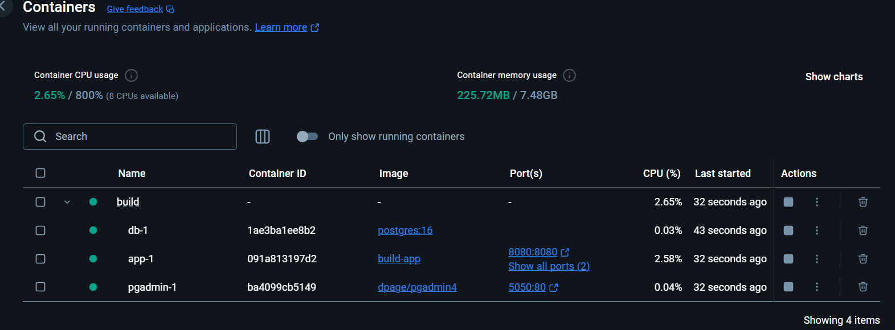

# 📅 Appointment Booking System

## 📑 Table of Contents
- [Overview](#-overview)
- [Key Features](#-key-features)
- [Architecture](#-architecture)
- [Tech Stack](#-tech-stack)
- [Project Structure](#-project-structure)
- [Setup & Installation](#-setup--installation)
- [Running the Application](#-running-the-application)
- [API Endpoints](#-api-endpoints)
- [Running Tests](#-running-tests)
- [Best Practices Followed](#-best-practices-followed)
- [TODO](#-todo)
- [License](#-license)
- [Author](#-author)

## 🚀 Overview

This is a **backend API** for an **Appointment Booking System**, allowing customers to book appointments with sales managers based on language, product, and customer rating criteria.

### **Key Features**

- 📅 **Customers can book 1-hour appointment slots.**
- 🔍 **API returns available appointment slots based on given filters.**
- 🗄️ **Uses PostgreSQL for database storage.**
- 🔧 **Built with .NET 8 using C#.**
- 📏 **Follows SOLID Principles and Repository Pattern.**
- ✅ **Includes Unit Tests and Integration Tests.**
- 🐳 **Production-ready using Docker and Docker Compose.**

---

## 🏗️ Architecture

The system follows **Clean Code principles** with **separation of concerns**:

- **Controllers** – Handle API requests and responses.
- **Services** – Business logic processing.
- **Repositories** – Data access layer, interacting with the database.
- **Entities/Models** – Define the data structures.
- **Database** – PostgreSQL using **EF Core (Code First Approach)**.

---

## 🛠️ Tech Stack

- **Backend**: .NET 8, C# 12.0
- **Database**: PostgreSQL
- **ORM**: Entity Framework Core
- **Testing**: xUnit, Moq (for Unit Tests), WebApplicationFactory (for Integration Tests)
- **Dependency Injection**: Built-in .NET DI
- **Containerization**: Docker

---

## 📂 Project Structure

- **Build**: Contains `docker-compose.yml` to set up the Docker environment.
- **Appointment.API**: Contains the API controllers and endpoints.
- **Appointment.Core**: Contains the core business logic and service interfaces.
- **Appointment.Domain**: Contains the domain entities.
- **Appointment.Infrastructure**: Contains the data access layer and repository implementations.
- **Appointment.Common**: Contains common DTOs and utility classes.
- **Appointment.Tests**: Contains unit tests for the application.

---

## 🚀 Setup & Installation

### **1️⃣ Clone the Repository**

```sh
git clone https://github.com/Vishnujeet/Appointment-Scheduling-App.git
cd Appointment-Scheduling-App
```

### **2️⃣ Configure Docker Environment**

Ensure **Docker** is installed and running on your system. The application is designed to run inside Docker containers.

`build/docker-compose.yml`.

---

## 🐳 Running the Application with Docker

This application is designed to run in a **containerized environment** using Docker. Follow the steps below to start the application and access its components.

---

### **1️⃣ Start the Application**
Run the following command to start the application and all its dependencies:

```sh
docker-compose -f build/docker-compose.yml up --build -d
```

This will:
- Build the Docker images (if not already built).
- Start the application and all required services in detached mode.



---

### **2️⃣ Access the Services**
Once the containers are up and running, you can access the following services:

#### 📊 PGAdmin (Database Management)
- **URL:** [http://localhost:5050](http://localhost:5050)
- **Username:** `admin@example.com`
- **Password:** `admin`

Use PGAdmin to manage and monitor your PostgreSQL database.

#### 📄 Swagger UI (API Documentation)
- **URL:** [http://localhost:8080/swagger/index.html](http://localhost:8080/swagger/index.html)

Explore the API endpoints, test requests, and view documentation using Swagger UI.

#### 🐘 PostgreSQL Database
- The PostgreSQL database is running inside the `db-1` container.
- It is automatically configured and connected to the application.
- Connection Configuration:
```sh
      Host=db
      Port=5432
      Database=coding-challenge
      Username=postgres
      Password=mypassword123!
```
- Use this configuration in PgAdmin to connect to the PostgreSQL database, PgAdmin is running on 5050.

---

### **3️⃣ Verify the Setup**
Ensure all containers are running by checking Docker logs:

```sh
docker-compose logs -f
```

Access the services via the provided URLs and verify their functionality.

---

### **4️⃣ Stop the Application**
To stop the application and all containers, run:

```sh
docker-compose -f build/docker-compose.yml down
```

This will gracefully shut down the containers and remove the network.

---

### ✅ Additional Notes
- Ensure Docker and Docker Compose are installed before running the commands.
- Modify `docker-compose.yml` if you need to change configurations.
- Run `docker ps` to check running containers.


---

## 📌 API Endpoints

### **Get Available Appointment Slots**

📍 **POST** `/calendar/query`

#### **Request Body**

```json
{
  "date": "2024-05-03",
  "products": ["Heatpumps"],
  "language": "English",
  "rating": "Silver"
}
```

#### **Response**

```json
[
  {
    "availableCount": 1,
    "startDate": "2024-05-03T10:30:00Z"
  },
  {
    "availableCount": 1,
    "startDate": "2024-05-03T11:00:00Z"
  },
  {
    "availableCount": 2,
    "startDate": "2024-05-03T11:30:00Z"
  }
]
```

#### **Possible HTTP Status Codes**

- `200 OK` – Request successful
- `400 Bad Request` – Invalid input data
- `500 Internal Server Error` – Unexpected server issue

---

## 🧪 Running Tests

### **Unit Tests**

```sh
dotnet test
```

### **Integration Tests**

```sh
dotnet test --filter Category=Integration
```

---

## 🏆 Best Practices Followed

✅ **SOLID Principles** (Separation of Concerns)  
✅ **Repository Pattern** (For maintainability)  
✅ **Unit Testing with Stubs**  
✅ **Integration Testing with In-Memory DB**  
✅ **Dependency Injection** for better testability  
✅ **Containerized Deployment using Docker**

---

## 📝 TODO
list of upcoming features, improvements, and fixes:

### **Features**
- [ ] Add authentication and authorization (e.g., JWT or OAuth).
- [ ] Implement a frontend interface for better user interaction.
- [ ] Add email/SMS notifications for appointment confirmations.
- [ ] Implement an **API Gateway** for routing, load balancing, and API management.

### **Improvements**
- [ ] Optimize database queries for better performance..

### **Fixes**

---

## 📜 License

MIT License. Feel free to use and modify this project.

---

## 👨‍💻 Author

**Vishnujeet**  
GitHub: [github](https://github.com/Vishnujeet)  
